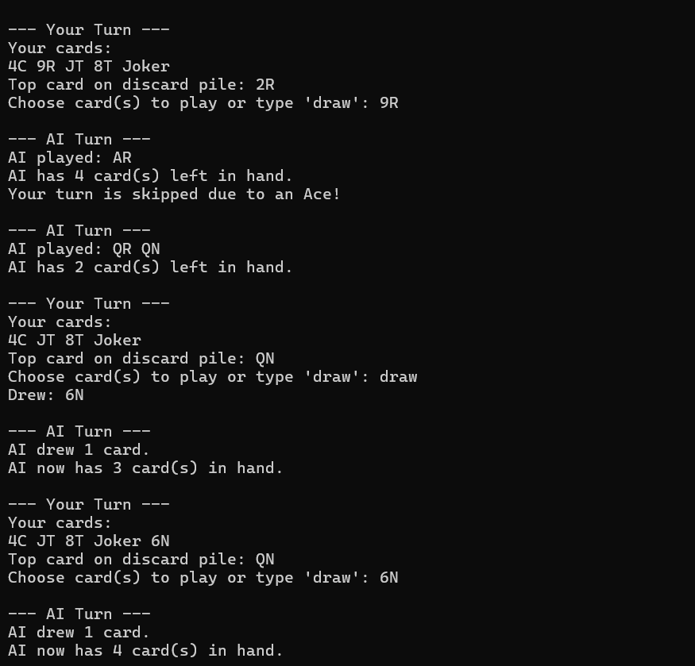
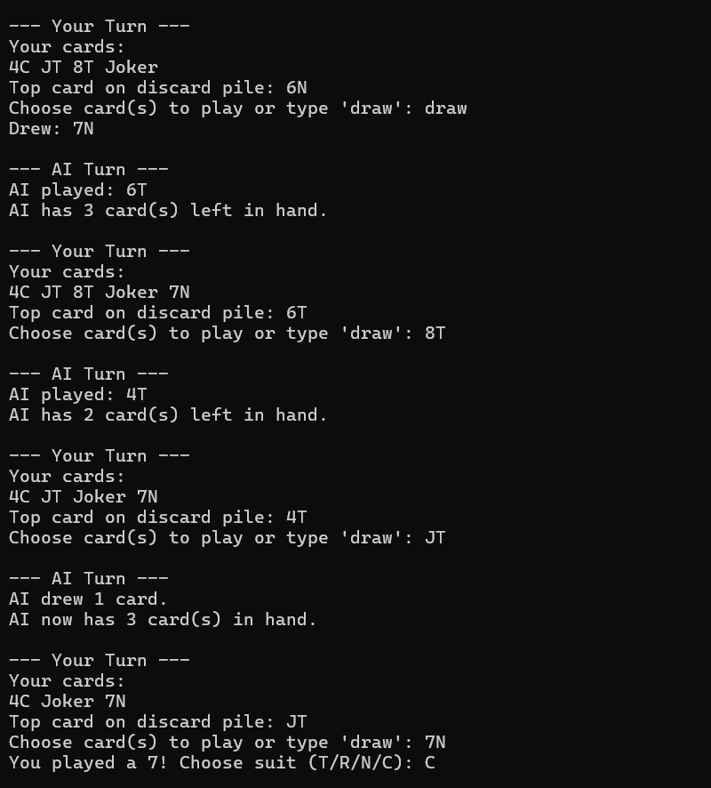
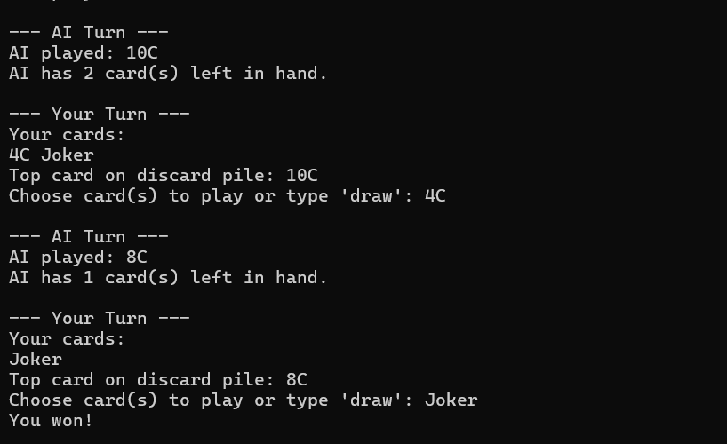
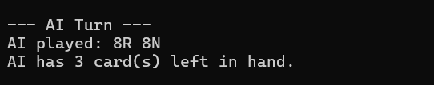
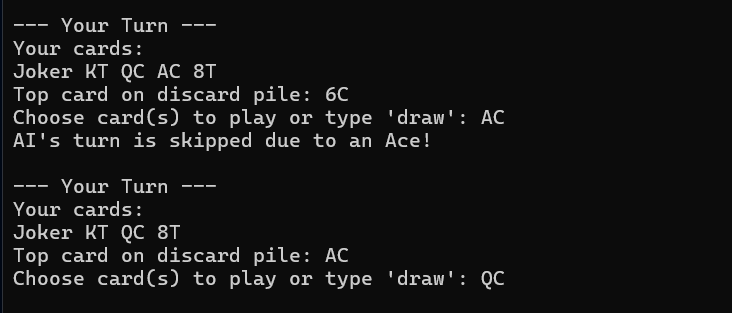
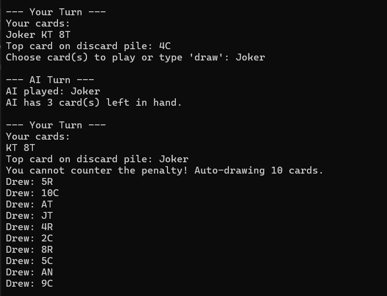

# Macao Game (C++)

A modern and interactive implementation of the Macao card game, developed in C++ as a console application. The project simulates a match between a human player and an intelligent AI bot.

## Development Environment and Technologies

- Language: C++ (Modern Standard)
- IDE: Visual Studio 2026
- Extension: Developed with Qt extension support in Visual Studio for logic management and project structuring.

## Implemented Game Rules

The game follows classic Macao rules, including special effect cards:
- 2 and 3: Forces the next player to draw 2 or 3 cards respectively. The effect is cumulative if the next player counters with a card of the same value.
- Joker: Forces the next player to draw 5 cards.
- Ace (A): The next player skips their turn.
- 7: Allows the player to change the current suit.
- Multiple Cards: Players can play multiple cards of the same value simultaneously to empty their hand faster.

## AI Algorithm (Greedy Strategy)

The artificial intelligence implemented uses a Greedy-type strategy:
- Group Prioritization: The AI always attempts to discard as many cards as possible by playing groups of cards with the same value.
- Suit Management: When changing the suit (using a 7), the AI selects the suit in which it holds the highest number of cards.
- Counter-attack: The bot immediately recognizes penalty situations and attempts to "counter" with a 2, 3, or Joker if available in its hand to avoid drawing cards.

---

## Visual Presentation (Output)

Below are sequences from the game simulation:

### 1. Standard Match Simulation
System performance and fluid round progression between the player and the AI.

### 2. AI Greedy Strategy
Example where the AI demonstrates efficiency by placing two cards of the same value at once.

### 3. Ace Effect
The moment a player is skipped due to an Ace being played.

### 4. Draw Penalty
The cumulative effect of Joker, 2, or 3 cards, resulting in a massive card draw penalty.

---

## How to Run
1. Open the `Macao.sln` file in Visual Studio 2026.
2. Compile and run the project (F5).
3. Follow the card input format (e.g., `10-C`, `A-R`, `7-T`, etc.).
