# Macao Game - WPF Implementation

A modern, SOLID-principled implementation of the classic Macao card game with a beautiful WPF interface and dark mode support.

## 🎮 Game Overview

Macao is a strategic card game where players take turns playing cards that match the top card's value or suit. The game features special cards with unique effects:

- **7 Cards**: Wild cards that can be played anytime and allow suit selection
- **Aces**: Skip the next player's turn
- **2s and 3s**: Force your opponent to draw 2 or 3 cards respectively
- **Jokers**: Force your opponent to draw 5 cards
- **Number Cards**: Standard matching gameplay

## 🏗️ Architecture

### SOLID Principles Implementation

#### Single Responsibility Principle (SRP)
- **`Game.cs`**: Core game logic and state management
- **`CardVisual.xaml.cs`**: Pure UI rendering of cards
- **`MacaoCardValidator.cs`**: Card validation logic
- **`MacaoAIStrategy.cs`**: AI decision-making
- **`DrawThreeEffect.cs`, `AceSkipEffect.cs`**: Individual card effects

#### Open/Closed Principle (OCP)
- **`ICardEffect`**: Extensible effect system
- **`IAIStrategy`**: Pluggable AI implementations
- **`ICardValidator`**: Customizable validation rules

#### Dependency Inversion Principle (DIP)
- **`Game`** depends on abstractions (`ICard`, `IPlayer`, `IDeck`)
- **Constructor injection** for validator, AI strategy, and effect resolver
- **Interface-based** domain model

### Project Structure
```
Macao-Game-V2/
├── Abstractions/          # Core interfaces
│   ├── ICard.cs
│   ├── IPlayer.cs
│   ├── IDeck.cs
│   ├── IGameState.cs
│   ├── ICardValidator.cs
│   ├── IAIStrategy.cs
│   └── ICardEffect.cs
├── Domain/              # Core domain entities
│   ├── Card.cs
│   ├── Player.cs
│   ├── Deck.cs
│   └── GameState.cs
├── AI/                 # AI implementation
│   └── MacaoAIStrategy.cs
├── Effects/             # Card effects
│   ├── DrawThreeEffect.cs
│   └── AceSkipEffect.cs
├── Validation/          # Card validation
│   └── MacaoCardValidator.cs
└── UI/                 # WPF interface
    ├── MainWindow.xaml
    ├── MainWindow.xaml.cs
    ├── CardVisual.xaml
    └── CardVisual.xaml.cs
```

## 🎨 Features

### Dark Mode Implementation
- **Toggle Button**: Circular sun/moon button in top-left corner
- **Dynamic Colors**: 
  - Light Mode: White cards with red/black text
  - Dark Mode: Black cards with red/white text
- **Background Transition**: Smooth gradient transitions
  - Light: Blue-green gradient (#2C3E50 → #4CA1AF)
  - Dark: Dark navy gradient (#0F0F19 → #19192D)

### Card Rendering System
- **Custom `CardVisual` UserControl**: Vector-based card rendering
- **Dependency Property `IsDarkMode`**: Runtime theme switching
- **Optimized Drawing**: Canvas-based with proper shadow effects
- **Responsive Design**: Scalable card sizes and layouts

### AI System
- **Strategic Decision Making**: 
  - Suit frequency analysis
  - Special card optimization
  - Defensive play patterns
- **Smart Suit Selection**: Chooses most frequent suit in hand
- **Effect Awareness**: Considers pending penalties and effects

## 🖼️ Screenshots Guide

### Game Flow (Images 7-14, excluding 8)
1. **Initial Setup**: Player and AI hands dealt, top card revealed
2. **Player Turn**: Valid cards highlighted, invalid cards disabled
3. **Card Play**: Smooth animations and state updates
4. **Special Effects**: 7 cards trigger suit selection, Aces skip turns
5. **AI Turn**: Intelligent card selection and automatic play
6. **Win Conditions**: Empty hand triggers game over screen

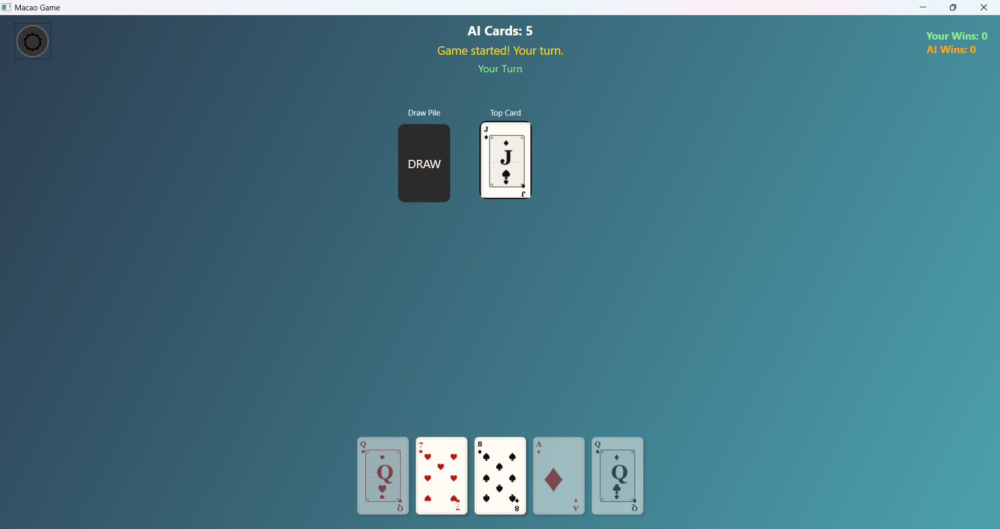
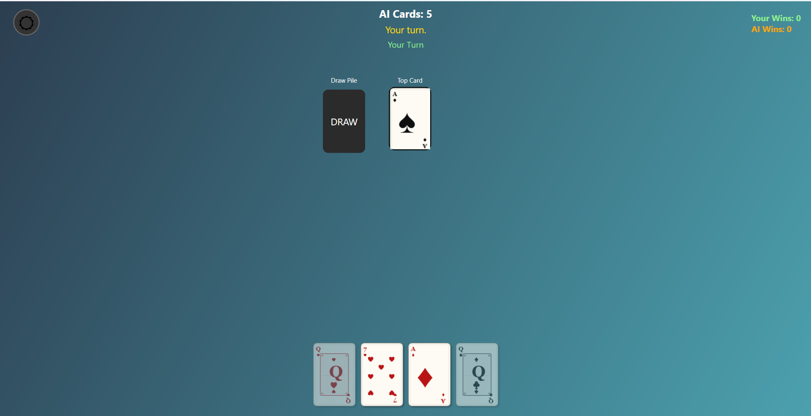
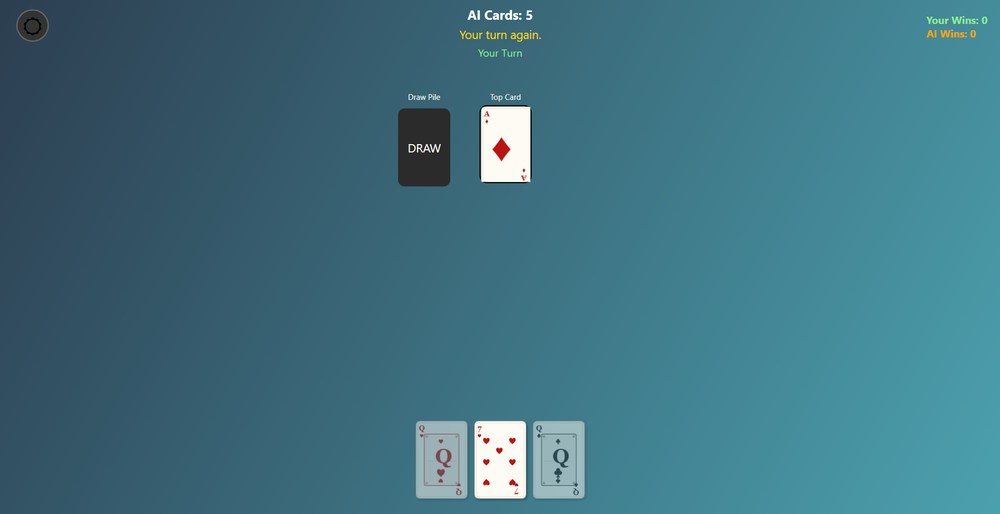
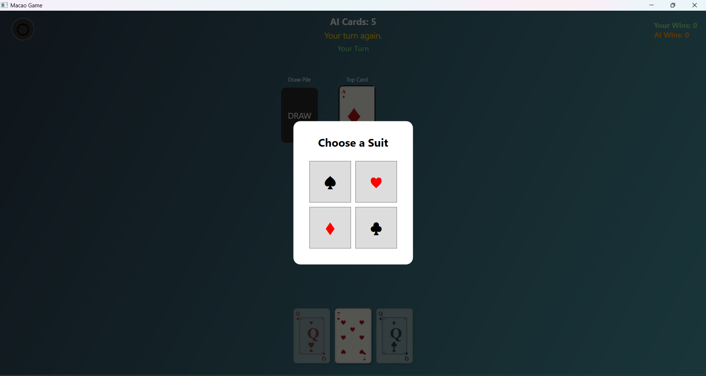
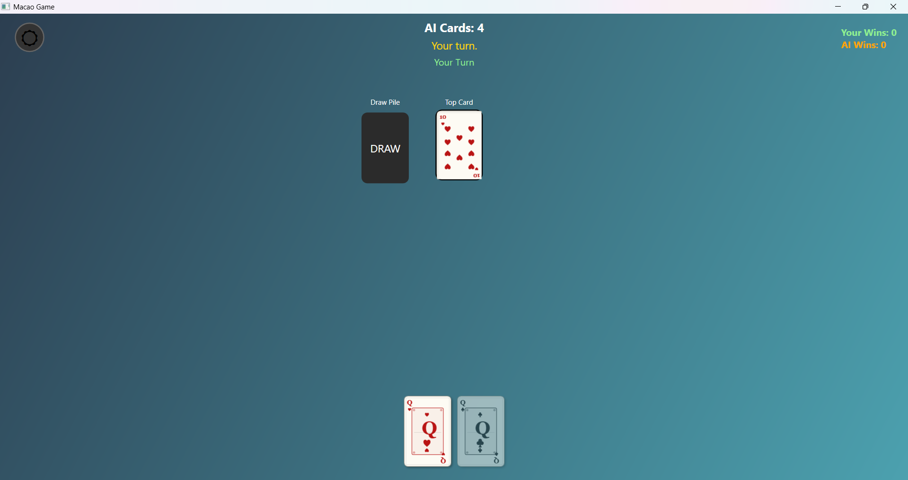
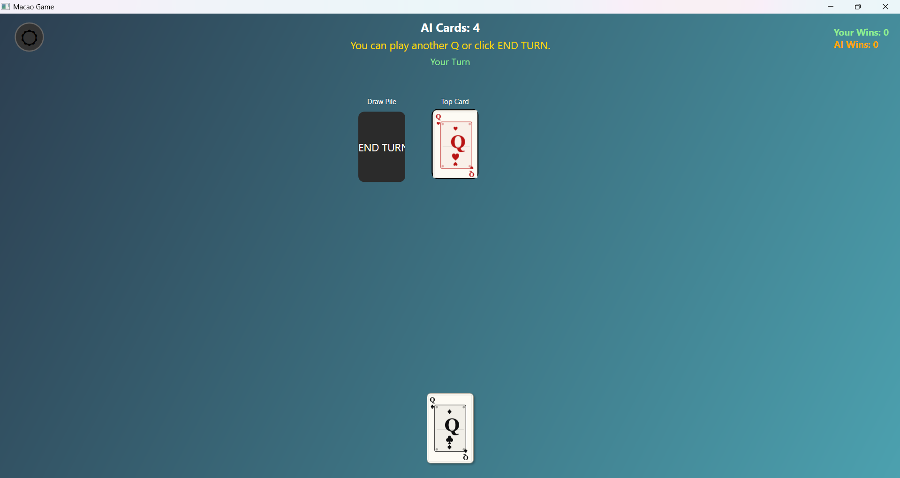
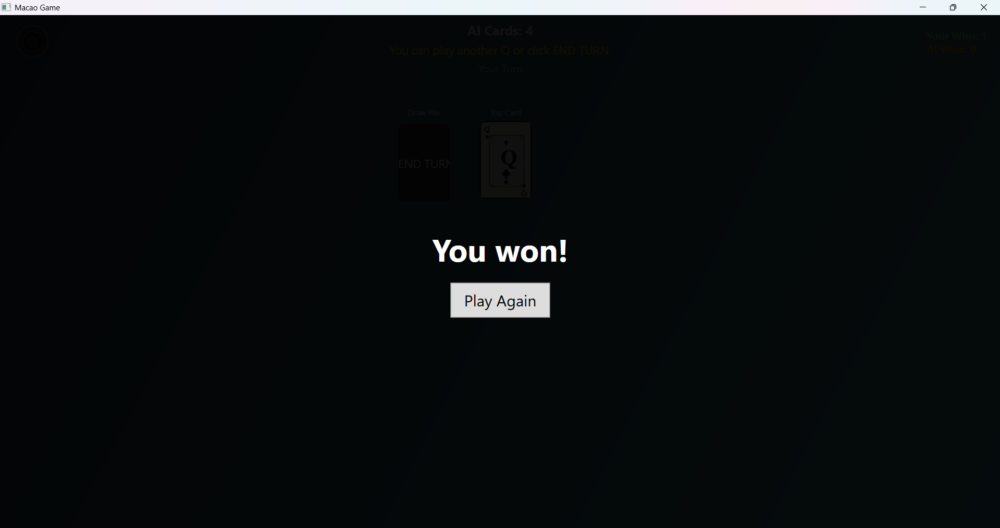

### Dark Mode (Image 8)
- **Toggle Button**: Sun/moon icon in top-left corner
- **Theme Transition**: Complete UI color scheme change
- **Card Appearance**: Black backgrounds with contrasting text
- **Background Gradient**: Dark navy theme

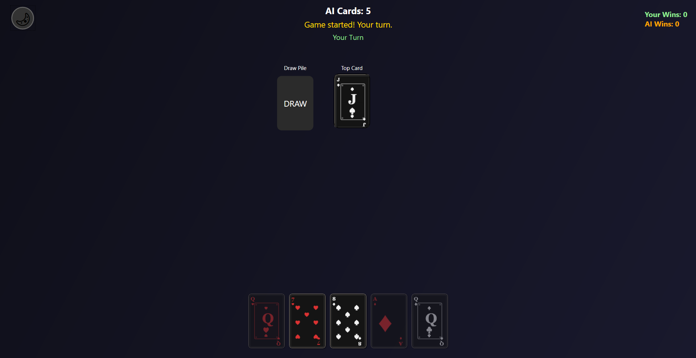

### Multi-Game Stats (Image 15)
- **Win Tracking**: Human vs AI victories displayed
- **Persistent Stats**: Counts survive across multiple games
- **Top-Right Display**: Clean, unobtrusive positioning

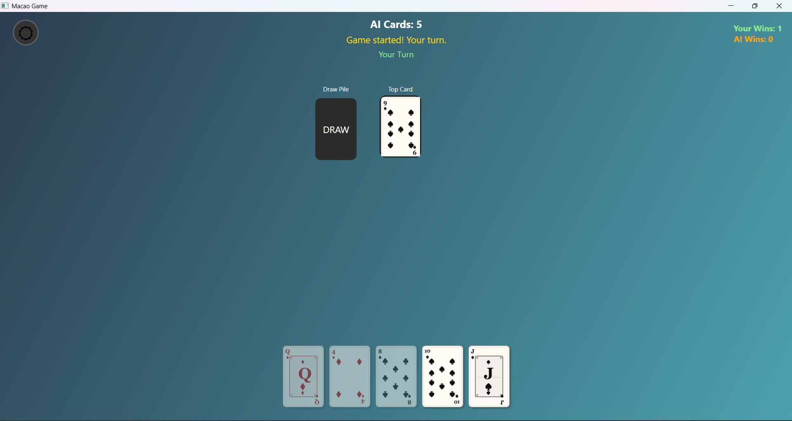

### Forced Draw Scenario (Image 16)
- **No Valid Cards**: All player cards disabled
- **Draw Pile Button**: Changes from "DRAW" to "END TURN"
- **Visual Feedback**: Red penalty text shows required cards
- **State Management**: Proper turn flow enforcement

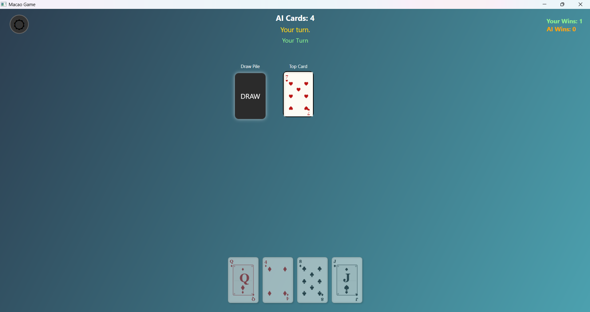

### Special Card Cases (Images 17-18)
- **Multiple 7s**: Stacking penalties and effect resolution
- **Ace Chains**: Consecutive skip effects
- **Joker Plays**: Wild card suit selection overlay
- **Effect Combinations**: Complex interaction scenarios

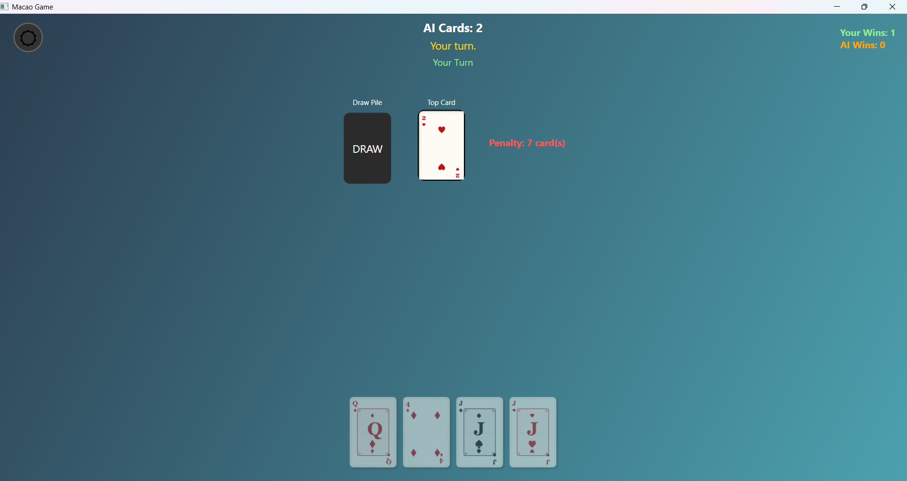
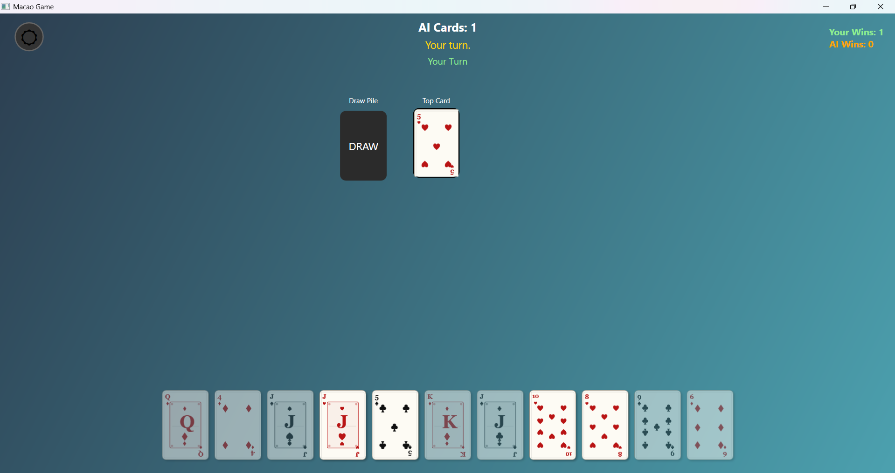

## 🚀 Getting Started

### Prerequisites
- **.NET 6.0+** or **.NET Framework 4.7.2+**
- **Windows OS** (WPF-specific)
- **Visual Studio 2019+** or **Visual Studio Code**

### Installation
1. Clone the repository
2. Open `Macao-Game-V2.sln` in Visual Studio
3. Restore NuGet packages (if any)
4. Build and run the project

### Controls
- **Left Click**: Play a valid card
- **Draw Pile**: Draw cards or end turn
- **Dark Mode Toggle**: Switch between light/dark themes
- **Suit Selection**: Choose suit after playing a 7
- **Restart**: Start a new game after game over

## 🎯 Game Rules

### Basic Gameplay
1. Each player starts with 7 cards
2. Players take turns playing cards that match:
   - Same **value** (number or face card)
   - Same **suit** (♠♥♦♣)
3. If unable to play, draw from deck
4. First player to empty their hand wins

### Special Cards
- **7**: Next player draws 2 cards OR you choose new suit
- **Ace**: Skip next player's turn
- **Joker**: Wild card - play anytime, choose any suit
- **Other Numbers**: Standard matching rules

### Winning
- Play all cards from your hand
- AI tracks wins across multiple games
- Game over screen shows winner and statistics

## 🔧 Technical Highlights

### Performance Optimizations
- **UI Virtualization**: Efficient card rendering for large hands
- **Minimal Redraws**: Smart invalidation only when needed
- **Memory Management**: Proper disposal of brushes and effects

### Code Quality
- **Clean Architecture**: Clear separation of concerns
- **Unit Testable**: Dependency injection enables easy testing
- **Extensible**: Interface-based design allows easy feature additions
- **Maintainable**: SOLID principles reduce coupling

### WPF Best Practices
- **MVVM-Ready**: Structure supports future MVVM migration
- **Resource Management**: Styles and templates properly organized
- **Responsive Design**: Adaptive layouts for different screen sizes
- **Accessibility**: Semantic markup and keyboard navigation

## 📝 Future Enhancements

- **Multiplayer Support**: Network play for multiple humans
- **Card Animations**: Smooth dealing and playing animations
- **Sound Effects**: Audio feedback for game events
- **Statistics Tracking**: Detailed game history and analytics
- **Custom Themes**: Additional color schemes and card designs
- **Tournament Mode**: Best-of series gameplay

## 📄 License

This project is open source and available under the MIT License.

---

**Enjoy playing Macao with this modern, well-architected WPF implementation!** 🎴✨
