# Macao Game - WPF Implementation

A modern, SOLID-principled implementation of the classic Macao card game with a beautiful WPF interface and dark mode support.

## 🎮 Game Overview

Macao is a strategic card game where players take turns playing cards that match the top card's value or suit. 

## 🎯 Game Rules

### Basic Gameplay
1. Each player starts with 5 cards
2. Players take turns playing cards that match:
   - Same **value** (number or face card)
   - Same **suit** (♠♥♦♣)
3. If unable to play, draw from deck (can draw at any time if you want to play a different strategy with your current hand later into the game)
4. First player to empty their hand wins

The game features special cards with unique effects:

- **7 Cards**: Wild cards that can be played anytime and allow suit selection
- **Aces**: Skip the next player's turn
- **2s and 3s**: Force your opponent to draw 2 or 3 cards respectively
- **Jokers**: Force your opponent to draw 5 cards
- **Number Cards**: Standard matching gameplay

## 🏗️ Architecture

### SOLID Principles Implementation

#### Single Responsibility Principle (SRP)
- **`Game.cs`**: Core game logic and state management
- **`CardVisual.xaml.cs`**: Pure UI rendering of cards
- **`MacaoCardValidator.cs`**: Card validation logic
- **`MacaoAIStrategy.cs`**: AI decision-making
- **`DrawThreeEffect.cs`, `AceSkipEffect.cs`**: Individual card effects

#### Open/Closed Principle (OCP)
- **`ICardEffect`**: Extensible effect system
- **`IAIStrategy`**: Pluggable AI implementations
- **`ICardValidator`**: Customizable validation rules

#### Liskov Substitution Principle (LSP)
- **`Card`** can be substituted with any `ICard` implementation
- **`MacaoAIStrategy`** can be replaced with any `IAIStrategy` without breaking functionality
- **Inheritance hierarchy** maintains behavioral contracts
- **Effects system** allows any `ICardEffect` to work with base game logic

#### Interface Segregation Principle (ISP)
- **Focused interfaces**: Each interface has a single, cohesive responsibility
- **`ICardValidator`**: Only validation concerns
- **`IAIStrategy`**: Only AI decision-making logic
- **`ICardEffect`**: Only effect application
- **No fat interfaces**: Clients depend only on methods they actually use
- **Optional dependencies**: Game works without needing all interface implementations

#### Dependency Inversion Principle (DIP)
- **`Game`** depends on abstractions (`ICard`, `IPlayer`, `IDeck`)
- **Constructor injection** for validator, AI strategy, and effect resolver
- **Interface-based** domain model

### Project Structure
```
Macao-Game-V2/
├── Abstractions/          # Core interfaces
│   ├── ICard.cs
│   ├── IPlayer.cs
│   ├── IDeck.cs
│   ├── IGameState.cs
│   ├── ICardValidator.cs
│   ├── IAIStrategy.cs
│   └── ICardEffect.cs
├── Domain/              # Core domain entities
│   ├── Card.cs
│   ├── Player.cs
│   ├── Deck.cs
│   └── GameState.cs
├── AI/                 # AI implementation
│   └── MacaoAIStrategy.cs
├── Effects/             # Card effects
│   ├── DrawThreeEffect.cs
│   └── AceSkipEffect.cs
├── Validation/          # Card validation
│   └── MacaoCardValidator.cs
└── UI/                 # WPF interface
    ├── MainWindow.xaml
    ├── MainWindow.xaml.cs
    ├── CardVisual.xaml
    └── CardVisual.xaml.cs
```

## 🎨 Features

### Dark Mode Implementation
- **Toggle Button**: Circular sun/moon button in top-left corner
- **Dynamic Colors**: 
  - Light Mode: White cards with red/black text
  - Dark Mode: Black cards with red/white text
- **Background Transition**: Smooth gradient transitions
  - Light: Blue-green gradient (#2C3E50 → #4CA1AF)
  - Dark: Dark navy gradient (#0F0F19 → #19192D)

### Card Rendering System
- **Custom `CardVisual` UserControl**: Vector-based card rendering
- **Dependency Property `IsDarkMode`**: Runtime theme switching
- **Optimized Drawing**: Canvas-based with proper shadow effects
- **Responsive Design**: Scalable card sizes and layouts

### AI System
- **Strategic Decision Making**: 
  - Suit frequency analysis
  - Special card optimization
  - Defensive play patterns
- **Smart Suit Selection**: Chooses most frequent suit in hand
- **Effect Awareness**: Considers pending penalties and effects

## 🎮 Game Showcase

### Complete Game Simulation (Images 1, 3-16)
A full gameplay demonstration showcasing all game mechanics and the improved card design:

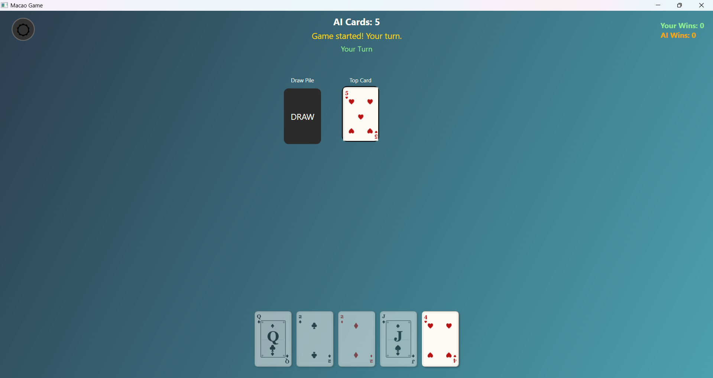
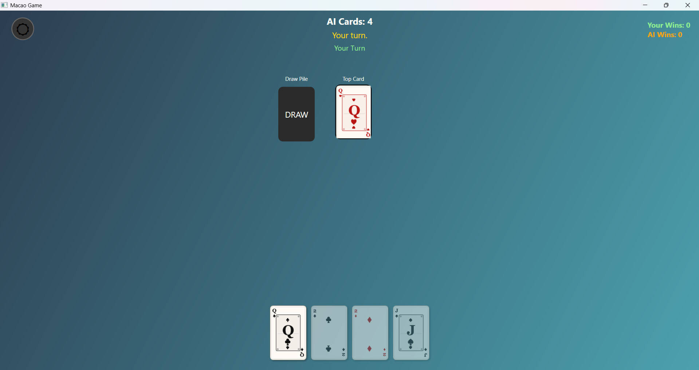
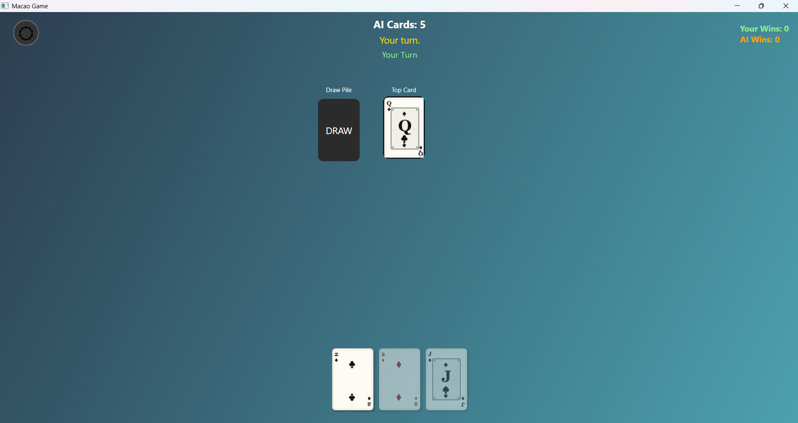
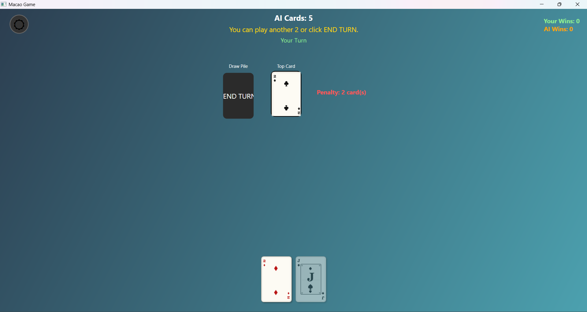

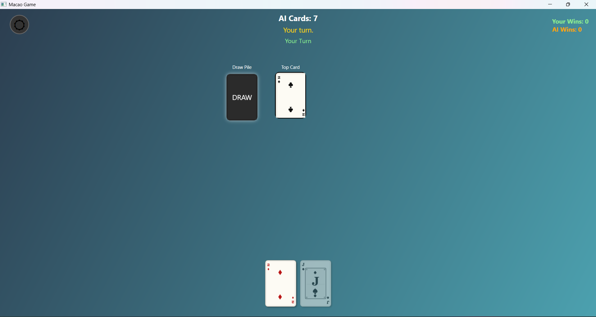
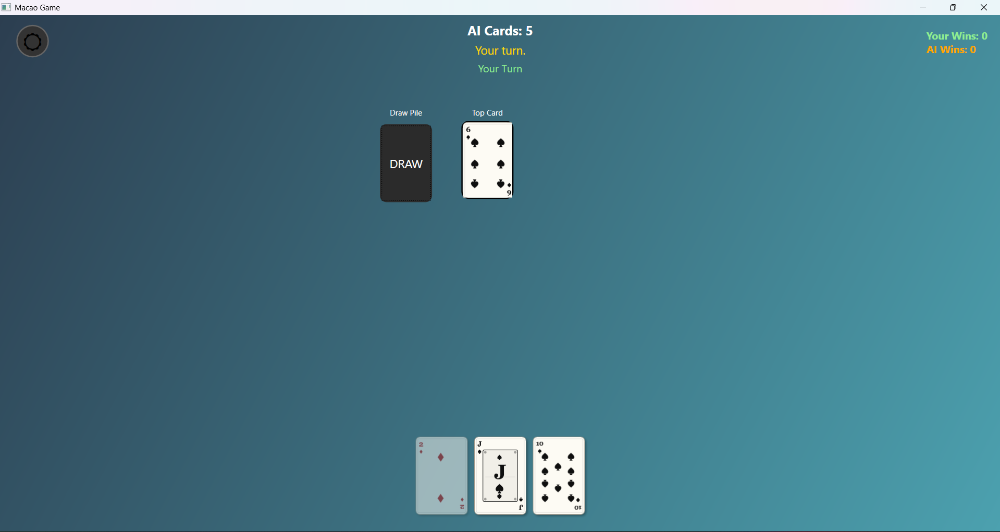
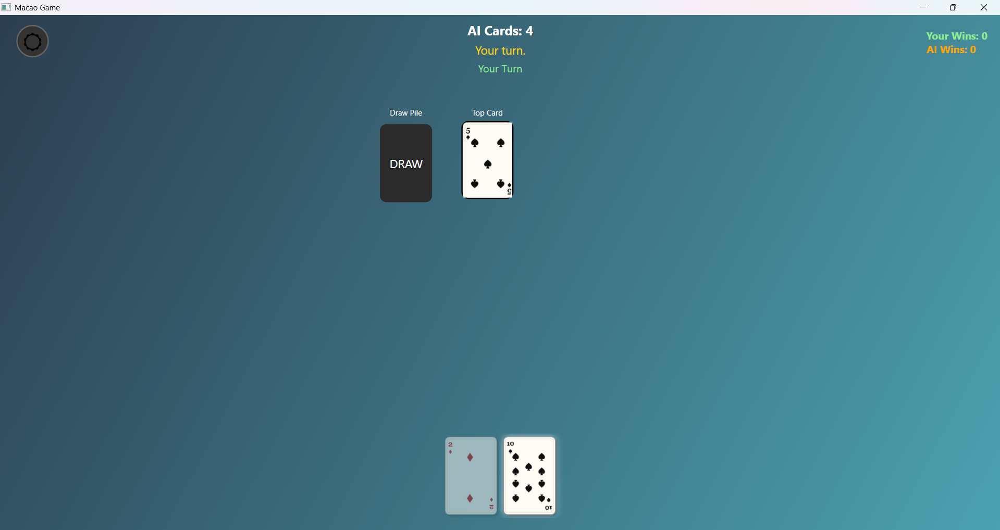
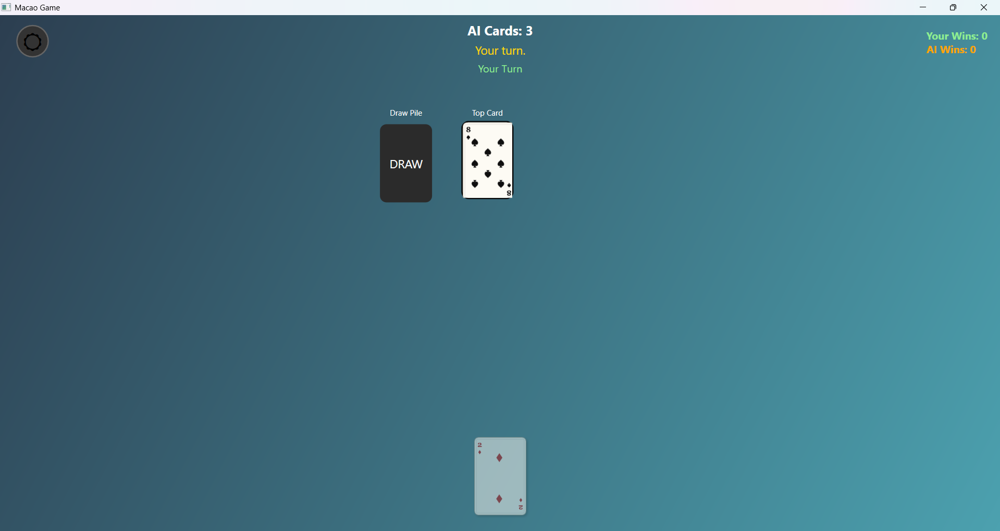
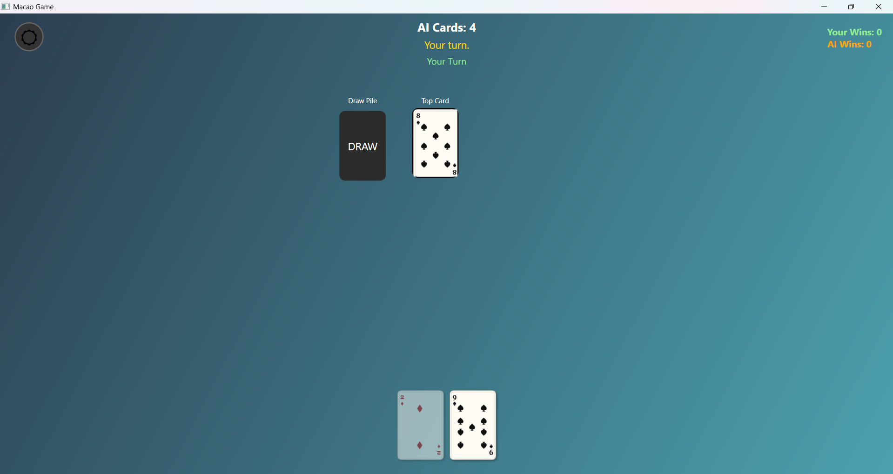

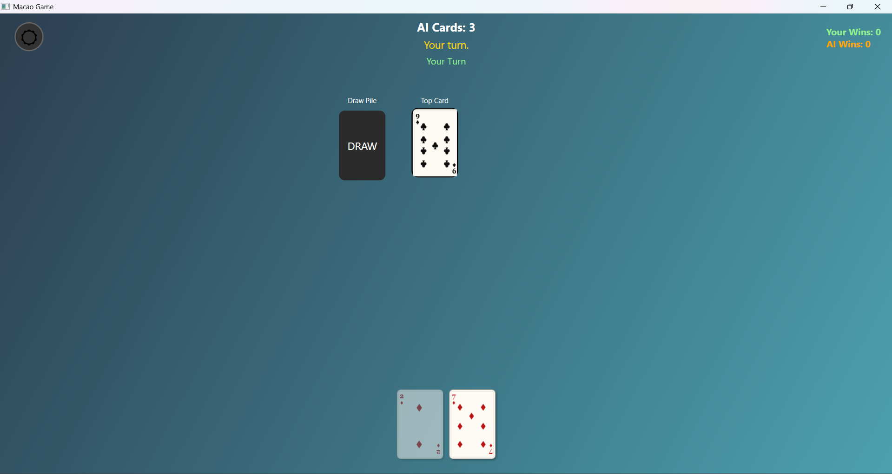
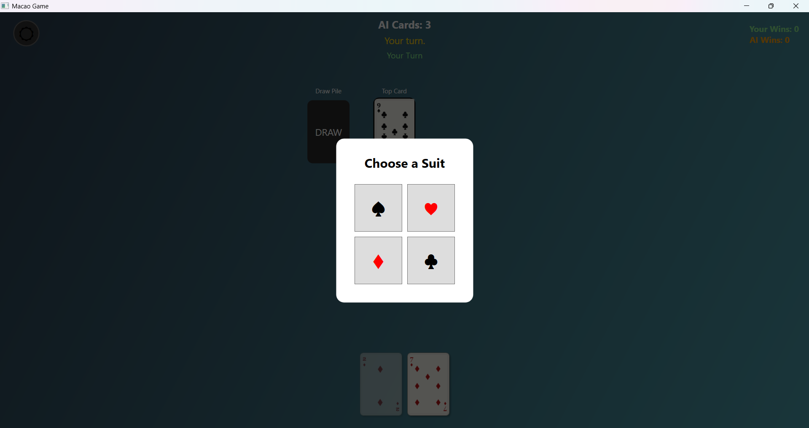
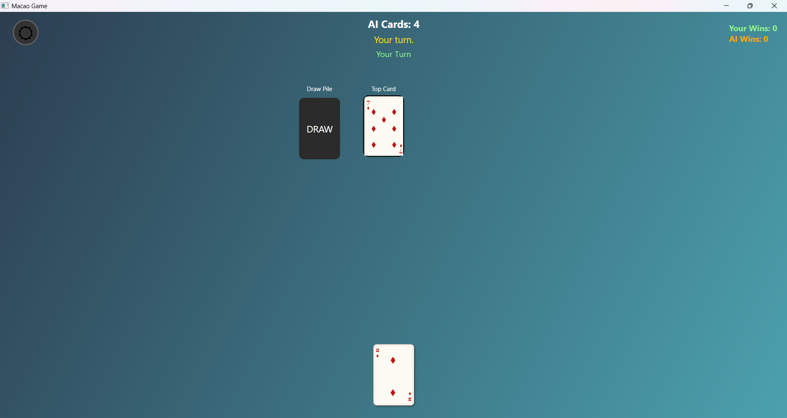
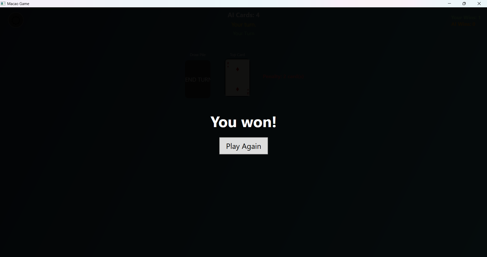

**Key Features Demonstrated:**
- **Image 5**: Penalty inflation towards opponent + holding two 2s in hand - simulating the choice to end turn instead of playing both 2s
- **Image 6**: AI inflates 2 cards (card count increases from 5 to 7)
- **Image 7**: 7 card allows draw or suit choice
- **Image 8**: Receiving cards after draw
- **Image 10**: No valid cards available - forced to draw
- **Images 13-15**: 7 card simulation - can play over any card with penalty + suit change
- **Image 16**: Victory condition
- **Image 17**: Multi-game statistics persistence across application runs
- **Image 18 (Bonus)**: Joker - can be played over any card

### Multi-Game Stats (Image 17)
- **Win Tracking**: Human vs AI victories displayed
- **Persistent Stats**: Counts survive across multiple games
- **Top-Right Display**: Clean, unobtrusive positioning

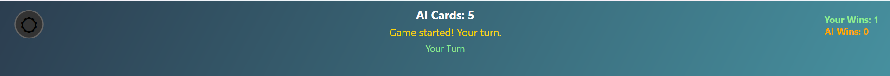

### Bonus: Joker (Image 18)
- **Wild Card**: Can be played over any card
- **Suit Selection**: Choose any suit after playing
- **Strategic Advantage**: Powerful game-changing effect

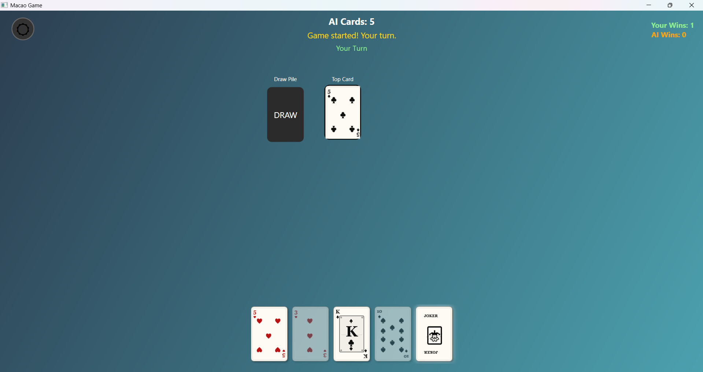

### Dark Mode (Image 2)
Toggle between light and dark themes with professional card rendering:

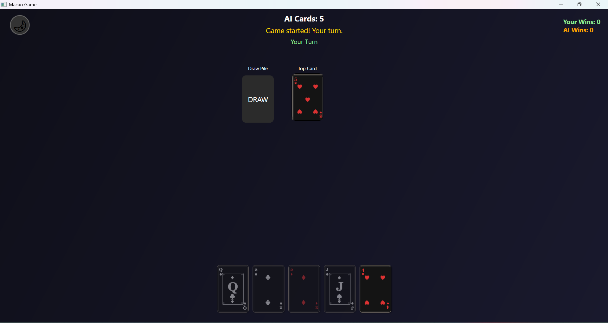

**Design Improvements:**
- ✅ **Perfect Ace centering** - Large suit symbols precisely centered
- ✅ **Uniform corner indices** - All number cards (6, 9, 10) have symmetrical alignment
- ✅ **Face card precision** - J, Q, K letters perfectly centered
- ✅ **Professional typography** - Consistent spacing and visual hierarchy

## 🚀 Getting Started

### Prerequisites
- **.NET 6.0+** or **.NET Framework 4.7.2+**
- **Windows OS** (WPF-specific)
- **Visual Studio 2019+** or **Visual Studio Code**

### Installation
1. Clone the repository
2. Open `Macao-Game-V2.sln` in Visual Studio
3. Restore NuGet packages (if any)
4. Build and run the project

### Controls
- **Left Click**: Play a valid card
- **Draw Pile**: Draw cards or end turn
- **Dark Mode Toggle**: Switch between light/dark themes
- **Suit Selection**: Choose suit after playing a 7
- **Restart**: Start a new game after game over

## 🔧 Technical Highlights

### Performance Optimizations
- **UI Virtualization**: Efficient card rendering for large hands
- **Minimal Redraws**: Smart invalidation only when needed
- **Memory Management**: Proper disposal of brushes and effects

### Code Quality
- **Clean Architecture**: Clear separation of concerns
- **Unit Testable**: Dependency injection enables easy testing
- **Extensible**: Interface-based design allows easy feature additions
- **Maintainable**: SOLID principles reduce coupling

### WPF Best Practices
- **MVVM-Ready**: Structure supports future MVVM migration
- **Resource Management**: Styles and templates properly organized
- **Responsive Design**: Adaptive layouts for different screen sizes
- **Accessibility**: Semantic markup and keyboard navigation

## 📝 Future Enhancements

- **Multiplayer Support**: Network play for multiple humans
- **Card Animations**: Smooth dealing and playing animations
- **Sound Effects**: Audio feedback for game events
- **Statistics Tracking**: Detailed game history and analytics
- **Custom Themes**: Additional color schemes and card designs
- **Tournament Mode**: Best-of series gameplay

## 📄 License

This project is open source and available under the MIT License.

---

**Enjoy playing Macao with this modern, well-architected WPF implementation!** 🎴✨
